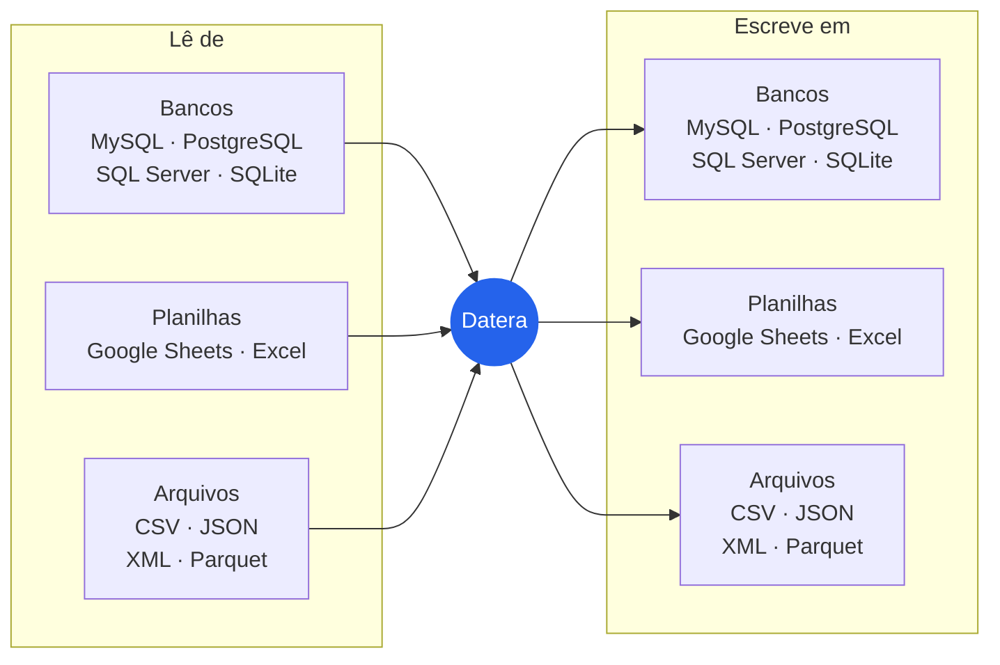

<p align="center">
  
</p>

<p align="center">Ferramenta pra limpar e juntar dados bagunçados de planilha, banco e arquivo.</p>

<p align="center">
  <a href="https://github.com/alessandravieiradev-blip/datera/actions/workflows/ci.yml"></a>
  <a href="https://www.npmjs.com/package/datera"></a>
</p>

<p align="center">
  <a href="docs/gestores.md"></a>
  <a href="docs/devs.md"></a>
</p>

## O que é

O Datera é um ETL que eu fiz em TypeScript. Ele lê dados de banco, planilha ou arquivo, arruma o que dá e escreve o resultado organizado em outro lugar:



Ele começou bem simples, era só pra copiar uma tabela do MySQL pra uma planilha. Só que aí eu fui vendo que dado de verdade vem uma bagunça: a mesma pessoa cadastrada duas vezes, e-mail com maiúscula num lugar e minúscula no outro, campo vazio, informação espalhada em várias colunas. Então fui colocando coisa nova até conseguir resolver quase tudo mexendo só no `config.json`.

## A ideia

Quem mais sofre com planilha bagunçada normalmente não é quem programa. É quem precisa da lista certinha pra mandar um e-mail, fechar um relatório ou ligar pra alguém. E essa pessoa não deveria ter que pedir ajuda toda vez que precisa dos dados limpos.

Então o Datera funciona assim: as regras ficam num arquivo de configuração (o `config.json`), que pode ser montado com calma uma vez só. Depois disso qualquer pessoa roda com um clique e recebe duas coisas: o resultado organizado e uma lista separada do que precisa de alguém dar uma olhada, com o motivo escrito do lado. Nada some sem explicação.

Por isso ele tem três jeitos de usar, todos com o mesmo motor e a mesma configuração:

| Jeito                 | Pra quem                                       | O que tem                                                                 |
| --------------------- | ---------------------------------------------- | ------------------------------------------------------------------------- |
| **Datera**            | quem cuida dos dados mas não programa          | app com tela, passo a passo, regras em frases, gráficos e histórico       |
| **Datera Dev**        | quem programa                                  | app escuro com editor da config, prévia na hora, log e paleta de comandos |
| **Terminal e código** | quem quer automatizar ou usar em outro projeto | o comando `datera` e funções pra usar no código, pelo npm                 |

## Como funciona

```text
fonte ──► prepara ──► separa o que tem problema ──► tira ou junta repetidos ──► destino
                               │
                               └──► pendências (com o motivo de cada uma)
```

1. **Fonte:** lê de onde os dados estão.
2. **Prepara:** preenche célula vazia e junta colunas, se você pedir.
3. **Pendências:** as linhas que quebram alguma regra (e-mail inválido, campo vazio, valor fora da lista...) vão pra uma aba ou arquivo à parte.
4. **Repetidos:** deixa como está, tira as linhas repetidas ou junta as linhas da mesma pessoa sem perder nada.
5. **Destino:** escreve o resultado onde você escolheu.

Hoje ele consegue:

- tirar linhas repetidas (`dedupe`) ou juntar as linhas da mesma pessoa sem perder nada (`merge`)
- usar normalizadores pra `Lia@Email.com` e ` lia@email.com` contarem como a mesma pessoa
- ter regras diferentes dependendo do tipo da chave
- decidir o que fazer com as linhas que não têm chave, sem elas sumirem nem se misturarem
- espalhar valores em várias colunas sem jogar nenhum fora
- ler e escrever em formatos diferentes sem mudar nada das regras
- gravar o resultado numa tabela nova de banco, sem nunca mexer numa tabela que não foi ele que criou
- converter um arquivo de um formato pra outro, tirar repetidos ou juntar cadastros com um comando só, sem montar config
- mostrar um raio-x das colunas de um arquivo (quantas vazias, quantos valores diferentes) antes de montar as regras
- ser usado dentro de outro projeto em JavaScript ou TypeScript, com as mesmas regras da config

## Escolha o seu caminho

<table>
<tr>
<td width="50%" valign="top">

### Para gestores

Você quer usar o app com tela: instalar, escolher de onde vêm os dados, montar as regras em frases e exportar. Não precisa saber programar.

<a href="https://github.com/alessandravieiradev-blip/datera/releases/latest"></a>
<a href="docs/gestores.md"></a>

</td>
<td width="50%" valign="top">

### Para devs

Você quer rodar pelo terminal, usar o Datera Dev, escrever a config na mão, criar normalizadores ou chamar o Datera de dentro de outro código.

```bash
npm install -g datera
```

<a href="docs/devs.md"></a>
<a href="docs/api.md"></a>

</td>
</tr>
</table>

## Todos os guias

| Guia                                                       | O que tem                                                            |
| ---------------------------------------------------------- | -------------------------------------------------------------------- |
| [Para gestores](docs/gestores.md)                          | instalar e usar o app com tela                                       |
| [Para devs](docs/devs.md)                                  | teste em 1 minuto, terminal, Datera Dev, uso em código e testes      |
| [Comandos e API](docs/api.md)                              | os comandos do terminal e as funções pra usar no seu código          |
| [Configuração](docs/configuracao.md)                       | todos os campos do `config.json`, os modos e as estratégias do merge |
| [Fontes e destinos](docs/fontes-e-destinos.md)             | cada formato que ele lê e escreve, e como criar o seu                |
| [Exemplos](docs/exemplos.md)                               | dez configs, do mais simples ao mais completo                        |
| [Preparação e pendências](docs/preparacao-e-pendencias.md) | `fillEmpty`, `combineColumns`, `distribute` e `validation`           |
| [Normalizadores](docs/normalizadores.md)                   | os prontos e como criar o seu                                        |
| [Estrutura do projeto](docs/estrutura.md)                  | o que tem em cada pasta                                              |

## Contribuir e licença

Se quiser ajudar, o jeito de rodar, testar e mandar mudanças está no [CONTRIBUTING.md](CONTRIBUTING.md). O código é aberto, sob a [licença MIT](LICENSE), e o que mudou em cada versão está no [CHANGELOG](CHANGELOG.md). Quem participa segue o [código de conduta](CODE_OF_CONDUCT.md), e falha de segurança se avisa pelo caminho do [SECURITY.md](SECURITY.md).

## Próximos passos

A ideia é que qualquer pessoa consiga usar o Datera: quem não programa, pelo instalador de um clique, e quem programa, pelo pacote no npm, no terminal ou no código.

O que eu quero fazer fica nas [issues](https://github.com/alessandravieiradev-blip/datera/issues), agrupadas em etapas nos [milestones](https://github.com/alessandravieiradev-blip/datera/milestones). Lá dá pra ver o que já foi feito e o que falta, e tudo se atualiza sozinho conforme eu vou fazendo.

Se quiser saber no que eu tô trabalhando agora, me chama no Instagram ou aqui no GitHub. Os dois estão no [meu perfil](https://github.com/alessandravieiradev-blip).
